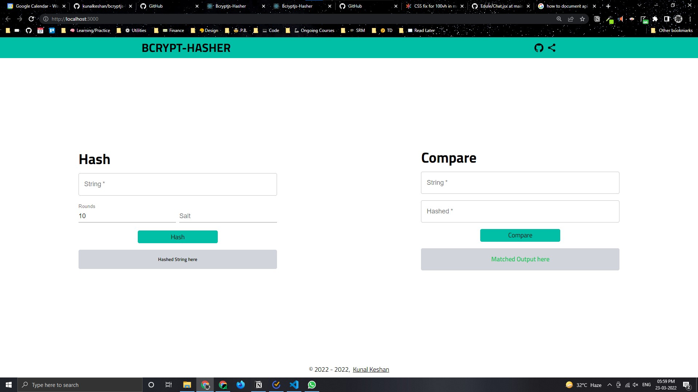
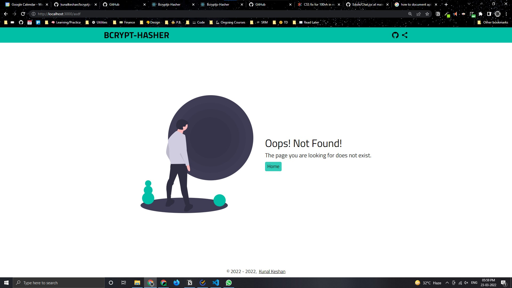
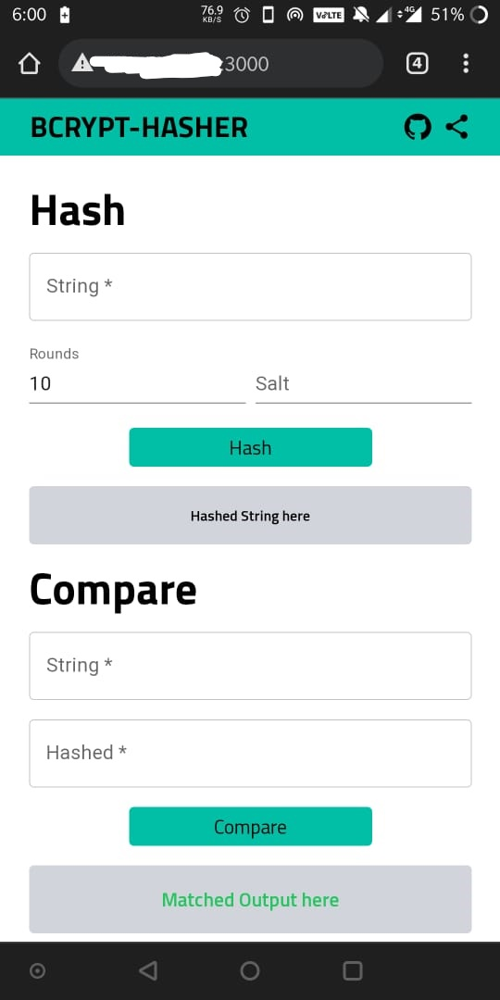
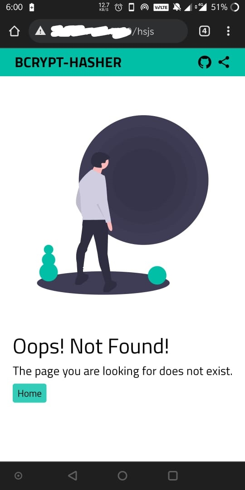

# Bcryptjs-Hasher

Simple website that hashes and compares strings using bcryptjs library. Made to learn Fastify.

## How to Run?

-   [Fork this Repo](https://github.com/kunalkeshan/bcryptjs-hasher).
-   Clone it.
-   Install all dependencies in the Root and in the Client directory.
-   `npm run build` in Client directory.
-   `npm start` in the Root directory.

## Application

### Backend Services

`POST /api/hash`

> Request Data: {string (required), rounds, salt}

> Response Data: {hashed, string, rounds, salt}

`POST /api/compare`

> Request Data: {string (required), hashed (required)}

> Response Data: {hashed, string, matched}

### React App Pages

#### Home - Desktop

#### Not Found - Desktop

#### Mobile View

| Home | Not Found |
| --- | --- |
|  |  |
